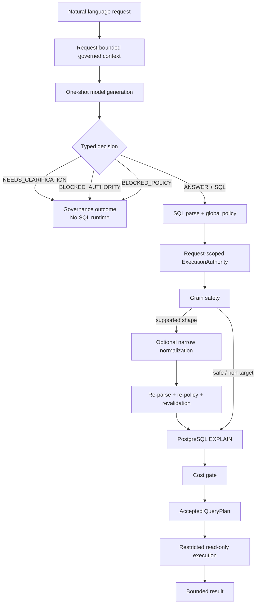

# Decision-SQL

**Governed one-shot Text-to-SQL with deterministic runtime safety.**

> The model proposes. Deterministic software decides what may execute.

[](https://github.com/negativexq/decision-sql/actions/workflows/ci.yml)

Decision-SQL turns a natural-language analytics request into one typed model
decision. The model receives a request-bounded governed context and may return
`ANSWER` with read-only SQL, `NEEDS_CLARIFICATION`, `BLOCKED_AUTHORITY`, or
`BLOCKED_POLICY`. It never receives permission to execute SQL.

Deterministic services own SQL admission, request authority, grain safety,
planning, cost checks, and restricted read-only execution. Evaluation is a
separate evidence boundary that measures the resulting behavior.


## Why Decision-SQL

| Capability | Boundary |
| --- | --- |
| Typed decisions | The model must explicitly answer, clarify, or block on authority or policy. |
| Deterministic execution boundary | `ANSWER` proposes SQL; it does not grant permission to execute. |
| Execution-based correctness | Results are checked against typed semantic contracts, not SQL-string equality. |

## Architecture

The production request path ends at a bounded result; the evaluator is not a
runtime stage:



Evaluation is outside that production path:

```text
production bounded result
      ↓
execution-based evaluator
      ↓
BASE + counterfactual fixtures
      ↓
typed semantic correctness
```

The evaluator scores behavior; it does not route requests or grant execution
authority.

## Operator Playground

The local Operator Playground makes one request lifecycle inspectable:
Playground, Runs, Traces, Governed Catalog, and the exact bounded context used
by an individual run. LIVE requests use the canonical Candidate C typed-decision
contract, one provider call, and the deterministic runtime. Safety and policy
replays are explicitly labelled and do not masquerade as live model output.

Start the local stack with:

```bash
docker compose up --build
```

Then open:

```text
UI:  http://localhost:3000
API: http://localhost:8000
```

The UI accepts natural-language requests only. It does not expose arbitrary SQL
execution or evaluator truth. Run details show model decision, runtime outcome,
proposed SQL when present, deterministic stages, bounded results, and safe trace
events.

## Current benchmark

Decision-SQL is evaluated on one 180-case governed Text-to-SQL benchmark across
12 synthetic database domains.

| Metric | Current benchmark |
| --- | ---: |
| Governed Task Success | **160/180 = 88.89%** |
| Answerable Runtime TSA | **108/122 = 88.52%** |
| Authority | **28/30 = 93.33%** |
| Ambiguity | **12/16 = 75.00%** |
| Policy | **12/12 = 100%** |

The benchmark contains 122 answerable cases and 58 cases where producing SQL
is not the correct behavior. All benchmark databases are synthetic; no customer
data is used.

## Why governed one-shot Text-to-SQL?

One-shot evaluation keeps first-pass behavior visible:

```text
1 case
→ 1 semantic attempt
→ no retry
→ no repair
→ no judge
→ no selector
→ no pass@K
```

For a non-`ANSWER` decision, the SQL runtime is bypassed. For `ANSWER + SQL`,
the proposal enters deterministic parsing, policy, authority, grain, planning,
and restricted execution. This makes the boundary explicit instead of hiding
decision or SQL errors behind a repair loop.

## Runtime trust boundary

The model's decision is not an execution permission. An accepted `ANSWER + SQL`
proposal follows this deterministic order:

```text
raw SQL
  ↓
sqlglot parse
  ↓
global SQL/object/function policy
  ↓
request-scoped ExecutionAuthority
  ↓
GrainSafetyValidator
  ↓
optional narrow deterministic normalization
  ↓
re-parse → re-policy → post-grain validation
  ↓
PostgreSQL EXPLAIN
  ↓
cost policy
  ↓
accepted immutable QueryPlan
  ↓
restricted ReadOnlyExecutor
  ↓
bounded result
```

Global SQL policy answers whether an object is technically queryable by the
service. Request-scoped authority answers whether this request may use it.
Decision-SQL keeps those checks separate.

The server derives an immutable relation-level `ExecutionAuthority` from the
request's governed context. SQLGlot extracts physical dependencies from tables,
joins, aliases, subqueries, nested subqueries, and CTEs; CTE aliases are not
treated as external relations. An unauthorized relation is rejected before
either the planning connection or the execution connection is acquired, so
`EXPLAIN` and execution are not entered.

The frozen `telecom_15` response is a useful safety regression: the model chose
`ANSWER` and proposed `SELECT subscriber_id FROM external_directory`, but the
runtime returned `AUTHORITY_REJECTION / UNAUTHORIZED_RELATION` with zero
planning connection, `EXPLAIN`, execution connection, and execution calls. This
does not make the model's governance decision correct; it prevents unsafe SQL
from reaching PostgreSQL.

The current authority contract is relation-level. Column-level authority and
relationship-path authority are separate boundaries and are not claimed here
as universally enforced. The SQL policy is PostgreSQL-oriented, read-only, and
single-statement. Accepted execution requires an immutable `QueryPlan`; raw SQL
or copied plan objects cannot bypass planning.

## Governed context

The product-owned context serializer is deterministic and exposes the semantic
boundary the model is allowed to use:

```text
schema_catalog
attributes
authorized_relationships
metrics
business_rules
temporal_rules
policy
```

Only server-owned authorized relationships enter the model-visible context.
The same request-scoped context lineage informs runtime authority, while runtime
checks remain independently authoritative. Empty governance sections are
explicit when no such metadata is configured; absence is not silently omitted.


## Server-owned grain safety

Joining a parent row to multiple child rows can duplicate a parent measure:

```text
parent row
   |
   +-- child 1
   +-- child 2
   +-- child 3
```

Server-owned metadata and `GrainSafetyValidator` detect the supported fanout
shape. The frozen normalizer is deliberately narrow:

```text
additive parent measure
+ direct declared 1:N relationship
+ supported LEFT JOIN fanout shape
+ additive child aggregation
→ deterministic child-side preaggregation
```

Normalization is not a general SQL optimizer or universal aggregation repair.
Any normalized query is re-parsed, re-authorized, revalidated for grain,
planned, cost-checked, and executed through the same restricted boundary.

Implementation boundaries are documented in
[`app/semantics/grain.py`](app/semantics/grain.py),
[`app/semantics/grain_normalizer.py`](app/semantics/grain_normalizer.py),
[`app/semantics/grain_runtime.py`](app/semantics/grain_runtime.py), and
[`app/sql/service.py`](app/sql/service.py).

## Execution-based correctness

Correctness is not exact SQL-string or AST matching. For answerable cases, the
evaluator uses reference SQL witnesses, a typed `ResultContract`, BASE
execution, and required counterfactual states. Comparisons preserve types,
NULLs, duplicates, and declared order semantics. Row order is unordered unless
the question requests it.

```text
candidate SQL
  ↓
BASE execution
  ↓
counterfactual executions
  ↓
typed ResultContract comparison
```

A wrong query can accidentally match BASE. Counterfactual fixtures distinguish
population, join-path, temporal, JSON, grain, NULL, ranking, rounding, and
other semantic behavior. `healthcare_10`, for example, passes BASE but fails a
counterfactual, showing why one database state is not enough to establish
semantic correctness.

## Current limitations

The current benchmark records 20 governed misses. Remaining errors span
governance decisioning, ambiguity recognition, SQL semantic mismatches, and
intentionally conservative fail-closed grain handling. The evidence does not
establish one causal breakdown for all 180 cases; detailed mechanisms remain in
the audit reports.

Ambiguity handling is weaker than policy handling on this benchmark: `12/16`
versus `12/12`. Authority decisioning is `28/30`; `telecom_15` remains the
known unauthorized `ANSWER` example. Runtime relation-level authority blocks
that candidate before database interaction, but this is not a claim of perfect
model governance or universal column and relationship-path authorization.

## Benchmark quality and audit discipline

The benchmark is audited model-blind before model responses are used to assess
system behavior:

```text
model-blind semantic review
→ contract correction before outcome inspection
→ benchmark freeze
→ exact provider-request fingerprinting
→ response admission
→ deterministic replay
```

The audited benchmark segment covered `90/90` cases, including `60/60`
answerable and `30/30` non-answerable. Audit corrections were made from the
specification and model-blind evidence, not from model performance. Detailed
defect counts and forensic mechanisms remain in the linked reports.

## Reproducibility and response provenance

The normative specification is [`benchmark/SPEC.md`](benchmark/SPEC.md).
Current identifiers are recorded in the machine-readable evaluation manifest:

```text
Post-M54 full benchmark truth:
672a749fad616908bb1a1c243ad21eb7798ec60c5520bc109cafc7e7b95a890a

M53.2 fresh response corpus:
7feb73f14a71f56dc8f33b43da43471fc6f5a9d749bc977b29087dd5e6e1be14

Post-M54 canonical response map:
e3ba0e8b02ea64ce75f34df0bebdd4d54f904e33675273d143d8cc8456e4ed21
```

The 180-case result combines frozen one-shot response corpora collected at
different experiment stages; it is not a single same-time batch run.

Current production Candidate C contract:

```text
3fb439e68cc158db6da5ea4bea31085d00776eb9573e5d743522922f74fb5587
```

Historical benchmark artifacts may retain older prompt or request hashes,
including `119ec8cfe489b9ef373e764a2e0702dcc0dc298090b906f41e582858c1f59ecb`.
Those values are immutable provenance for historical runs, not the current
production contract.

## Repository map

```text
app/
├── api/             # FastAPI routes
├── catalog/         # server-owned physical catalog
├── decision/        # canonical production request lifecycle
├── execution/       # EXPLAIN, cost gates, restricted reader
├── generation/      # Candidate C contract and provider boundary
├── governance/      # product-owned governed context
├── observability/   # OTEL and operator trace
├── operator/        # Playground and run facade
├── retrieval/       # bounded context resolution
├── semantics/       # grain safety and normalization
└── sql/             # parser, policy, authority, QueryPlan safety

ui/                  # React operator console

benchmark/
├── cases/           # model-visible benchmark questions
├── ground_truth/    # evaluator-only semantic truth
├── fixtures/        # evaluator-only counterfactual patches
├── references/      # evaluator-only SQL witnesses
├── audits/          # frozen milestone and provenance evidence
├── reports/         # human-readable findings
└── manifests/       # machine-readable experiment contracts

tests/               # runtime, contract, and benchmark-harness tests
docs/                # architecture and research documentation
```

The production boundary is concentrated in
[`app/decision/service.py`](app/decision/service.py),
[`app/governance/context.py`](app/governance/context.py),
[`app/generation/decision_contract.py`](app/generation/decision_contract.py),
[`app/sql/service.py`](app/sql/service.py),
[`app/sql/authority.py`](app/sql/authority.py), and
[`app/execution/reader.py`](app/execution/reader.py). Benchmark truth,
references, fixtures, and audit artifacts remain separate from production
routing and model-visible requests.

## Running locally and tests

The project targets Python 3.12. With development dependencies installed:

```bash
python -m pytest -q
ruff check .
ruff format --check .
mypy .
```

The deterministic test suite does not require a live provider. Compose starts
the complete local demo stack: PostgreSQL, migrations, seed data, API, and UI.
Provider-backed LIVE generation is an explicitly configured operation and is
not implied by running the normal test suite.

## Tech stack

```text
Python 3.12       FastAPI             PostgreSQL 16
SQLAlchemy        Alembic             sqlglot
Pydantic          OpenTelemetry       Docker Compose
pytest            Ruff                mypy
React             TypeScript          Vite
```

Model access is isolated behind an OpenAI-compatible provider boundary.

## Evidence and reports

Start with the normative [benchmark specification](benchmark/SPEC.md). Useful
evidence includes:

- [Operator Playground documentation](docs/m62_operator_playground.md)
- [Benchmark semantic repair summary](benchmark/reports/m53_benchmark_semantic_repair_summary.md)
- [Response provenance recovery](benchmark/reports/m531r_response_reuse_provenance_recovery.md)
- [Current benchmark evaluation](benchmark/reports/m532_post_m53_repaired_expansion_evaluation.md)
- [Runtime authority safety report](benchmark/reports/m52s_runtime_authority_execution_safety.md)
- [Post-M53 residual semantic forensics](benchmark/reports/m54_post_m53_residual_semantic_forensics.md)

The machine-readable current manifest is
[`benchmark/manifests/m54_post_m53_residual_semantic_forensics_manifest.json`](benchmark/manifests/m54_post_m53_residual_semantic_forensics_manifest.json).
Detailed audit evidence remains under
[`benchmark/audits/`](benchmark/audits/) and
[`benchmark/reports/`](benchmark/reports/).

## Scope

The current evidence supports governed one-shot decision evaluation,
deterministic SQL admission, the narrow grain-normalization shape described
above, PostgreSQL planning and cost gates, accepted-`QueryPlan` execution,
restricted read-only execution, and execution-based semantic evaluation with
counterfactual testing.

It does not establish:

- general Text-to-SQL accuracy;
- universal SQL correctness, fanout repair, or business-semantic understanding;
- production readiness for arbitrary enterprise schemas;
- complete tenant-level authorization or RLS coverage;
- safety for SQL outside the frozen runtime and benchmark contracts.

## Project status

The current implementation includes the canonical one-shot production decision
path, request-bounded governed context, deterministic runtime safety,
execution-based evaluation, and a local Operator Playground for inspecting
decisions, SQL, traces, and model-visible context.

Further benchmark or model-quality work is separate from the current production
and demo boundary.
