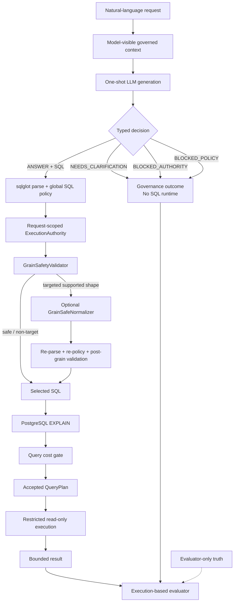
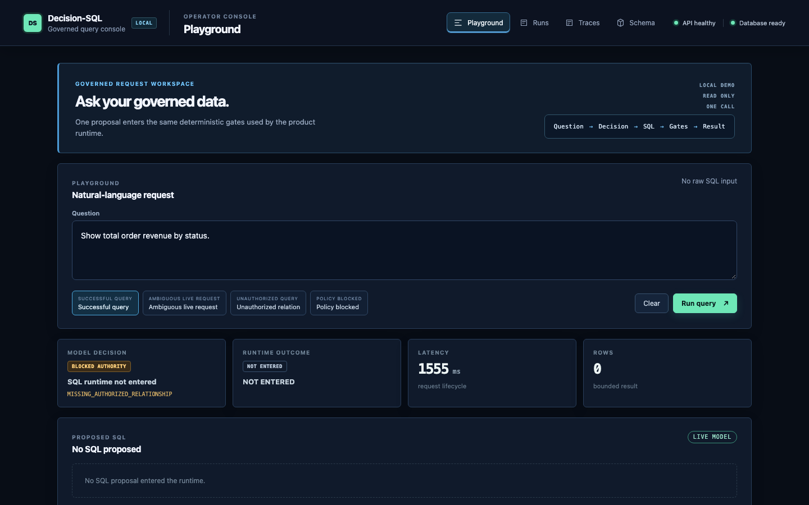
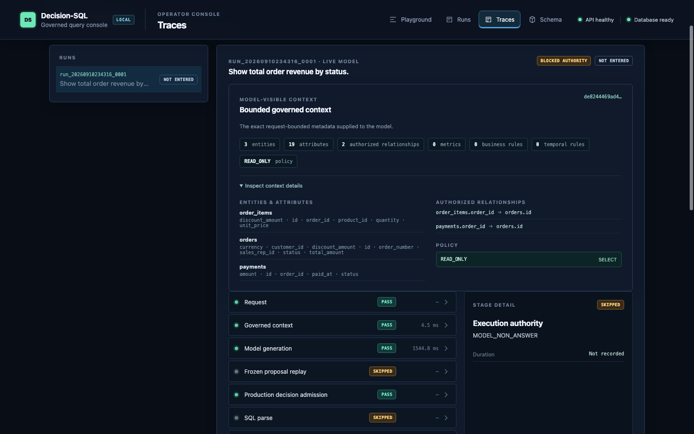

# Decision-SQL

**Governed one-shot Text-to-SQL with deterministic runtime safety and execution-based semantic evaluation.**

> The model proposes. Deterministic software decides what may execute.

Decision-SQL is an engineering system for governed analytics requests. A model
receives a natural-language question and a model-visible governed context, then
emits one typed decision: answer with read-only SQL, ask for clarification, or
block on authority or policy. The model never receives permission to execute
SQL directly. Deterministic services own admission, planning, cost checks, and
restricted execution.

The benchmark measures both sides of that boundary. Governance cases test when
the correct behavior is not to write SQL; answerable cases test whether a
submitted query survives the real runtime and returns the requested semantics
on BASE and discriminating counterfactual database states.

## Current benchmark

Decision-SQL is evaluated on one 180-case governed Text-to-SQL benchmark across
12 synthetic database domains.

| Metric | Current benchmark |
| --- | ---: |
| Governed Task Success | **160/180 = 88.89%** |
| Answerable Runtime TSA | **108/122 = 88.52%** |
| Authority | **28/30 = 93.33%** |
| Ambiguity | **12/16 = 75.00%** |
| Policy | **12/12 = 100%** |

The benchmark contains 122 answerable cases and 58 cases where producing SQL
is not the correct behavior. All benchmark databases are synthetic; no
customer data is used.

## Architecture

The production request path is:

```text
request
  ↓
governed model-visible context
  ↓
one-shot typed decision
  ├─ governance outcome → no SQL runtime
  └─ ANSWER + SQL
       ↓
     parse → global policy → request authority
       ↓
     optional narrow grain-safe normalization
       ↓
     re-parse → re-policy → post-grain validation
       ↓
     PostgreSQL EXPLAIN → cost gate → QueryPlan
       ↓
     restricted read-only execution
       ↓
     BASE + counterfactual semantic evaluation
```



The evaluator is outside the production trust boundary. It scores behavior; it
does not route requests or grant execution authority.




## Operator playground

The local operator console presents a real natural-language request lifecycle:
typed model decision, deterministic gates, EXPLAIN/cost admission, read-only
execution, bounded results, and trace events. Live requests use the canonical
production path; safety replays evaluate server-bound frozen proposals without
a provider call. Start it with
`docker compose up --build`; the UI is at `http://localhost:3000` and the API
at `http://localhost:8000`. It includes presentation-safe successful,
clarification, policy, and authority-rejection scenarios without exposing
benchmark truth or accepting raw SQL. Each run also exposes the exact bounded
model-visible context used for that request.

### What the model owns

The model owns the first-pass typed decision and, when it chooses `ANSWER`, the
proposed SQL. It does not own authorization, physical schema truth, relationship
authority, grain safety, cost admission, or the right to execute.

### What deterministic software owns

The server validates the response schema, parses SQL, enforces read-only and
object policy, checks governed relationships and grain safety, applies only
narrow supported normalization, runs PostgreSQL `EXPLAIN`, applies cost limits,
issues an immutable `QueryPlan`, and executes through a restricted reader.

## Why governed one-shot Text-to-SQL?

One-shot evaluation makes the first-pass behavior observable:

```text
1 case
→ 1 semantic attempt
→ no retry
→ no repair
→ no judge
→ no selector
→ no pass@K
```

This prevents a retry or repair loop from hiding model decision errors, SQL
semantic errors, or unsafe assumptions. It does not claim that production
applications can never use confirmation or repair workflows; it defines a clear
measurement boundary for this system.

The main trust-boundary principle is simple:

```text
model proposes SQL ≠ model receives permission to execute SQL
```

For a governance decision that is not `ANSWER`, the SQL runtime is bypassed.
For `ANSWER + SQL`, the actual submission enters the same deterministic parse,
policy, grain, planning, and restricted-execution path regardless of whether
evaluator truth later marks the decision correct.

## Governed task model

The current benchmark has four behavior classes:

| Task | Cases | Expected model decision |
| --- | ---: | --- |
| `ANSWERABLE` | **122** | `ANSWER` + read-only `SELECT` |
| `AUTHORITY_BLOCKED` | **30** | `BLOCKED_AUTHORITY` |
| `AMBIGUOUS` | **16** | `NEEDS_CLARIFICATION` |
| `POLICY_BLOCKED` | **12** | `BLOCKED_POLICY` |
| **Total** | **180** | |

The 12 synthetic domains are:

```text
commerce_ops              fleet_ops
support_ops               subscription_billing
warehouse_logistics       risk_operations
procurement_ops            insurance_claims
telecom_billing            marketplace_ops
workforce_ops              healthcare_billing
```

## Runtime trust boundary

The model's authority decision is not an execution boundary. For `ANSWER + SQL`,
the selected query follows this order:

```text
raw SQL
  ↓
sqlglot parse
  ↓
global SQL/object/function policy
  ↓
request-scoped `ExecutionAuthority`
  ↓
`GrainSafetyValidator`
  ↓
optional narrow deterministic normalization
  ↓
re-parse → re-policy → post-grain validation
  ↓
PostgreSQL EXPLAIN
  ↓
cost policy
  ↓
accepted immutable QueryPlan
  ↓
restricted ReadOnlyExecutor
  ↓
bounded result
```

Global SQL policy answers whether an object is technically queryable by the
service. Request-scoped authority answers whether this request may use it.
Decision-SQL keeps those checks separate.

The server derives an immutable relation-level `ExecutionAuthority` from the
same governed `SchemaContext` that supplies model-visible relations. SQLGlot
structurally extracts physical dependencies from tables, joins, aliases,
subqueries, nested subqueries, and CTEs. CTE aliases are not treated as
external relations. An unauthorized relation is rejected before connection
acquisition, `EXPLAIN`, or execution.

The frozen `telecom_15` response is a useful safety regression: the model chose
`ANSWER` and proposed `SELECT subscriber_id FROM external_directory`, but the
runtime returned `AUTHORITY_REJECTION / UNAUTHORIZED_RELATION` with zero
database connection, `EXPLAIN`, and execution calls. This does not make the
model's governance decision correct; it prevents the unsafe SQL from reaching
PostgreSQL.

The current authority contract is relation-level. Column-level authority and
relationship-path authority are separate boundaries and are not claimed here
as universally enforced.

The SQL policy is PostgreSQL-oriented and enforces one statement, read-only
`SELECT`/CTE behavior, governed object access, function restrictions,
relationship/object policy, and complexity controls. The reader uses a
read-only transaction, reader-role enforcement, statement timeout, and bounded
result rows. Accepted execution requires a `QueryPlan`; raw SQL or copied plan
objects cannot bypass planning.

This is a deterministic application boundary, not a claim of universal SQL
security, complete tenant/RLS coverage, or safety for SQL outside the frozen
contracts.

## Server-owned grain safety

Joining a parent row to multiple child rows can duplicate a parent measure:

```text
parent row
   |
   +-- child 1
   +-- child 2
   +-- child 3
```

Server-owned metadata and `GrainSafetyValidator` detect the supported fanout
shape. The frozen normalizer is deliberately narrow:

```text
additive parent measure
+ direct declared 1:N relationship
+ supported LEFT JOIN fanout shape
+ additive child aggregation
→ deterministic child-side preaggregation
```

Normalization is not a general SQL optimizer or universal aggregation repair.
Any normalized query must be re-parsed, re-authorized, revalidated for grain,
planned, cost-checked, and executed through the same restricted boundary. There
is no raw unsafe fallback. The benchmark still records fail-closed grain
rejections; their causes are under investigation rather than assumed to be
runtime defects.

Implementation boundaries are documented in
[`app/semantics/grain.py`](app/semantics/grain.py),
[`app/semantics/grain_normalizer.py`](app/semantics/grain_normalizer.py),
[`app/semantics/grain_runtime.py`](app/semantics/grain_runtime.py), and
[`app/sql/service.py`](app/sql/service.py).

## Execution-based correctness

Correctness is not exact SQL-string or AST matching. For answerable cases, the
evaluator uses two reference SQL witnesses, a typed `ResultContract`, BASE
execution, and every required counterfactual state. Comparisons preserve types,
NULLs, duplicates, and declared order semantics. Row order is unordered unless
the question requests it; a reference `ORDER BY` alone does not make row order
semantic.

Reference SQL is evidence of a valid implementation, not canonical SQL that a
model must reproduce. The candidate is accepted only when its actual runtime
and results satisfy the evaluator contract.

### Counterfactual fixtures

A wrong query can accidentally match the correct result on BASE. Counterfactual
fixtures alter relevant rows or distributions to distinguish population,
join-path, temporal, JSON, grain, NULL, ranking, rounding, and other semantic
behaviors. The current answerable evidence includes `healthcare_10`, which
passes BASE but fails a counterfactual. That case shows why one database state
is not enough to establish semantic correctness.

## Current limitations

The current benchmark records 20 governed misses overall. The remaining errors
span governance decisioning, ambiguity recognition, SQL semantic mismatches,
and intentionally conservative fail-closed grain handling. The current evidence
does not establish a single causal breakdown for all 180 cases; detailed
mechanisms belong in the audit reports.

Ambiguity handling is weaker than policy handling on this benchmark: `12/16`
versus `12/12`. Authority decisioning is `28/30`; `telecom_15` remains the
known unauthorized `ANSWER` example. Runtime relation-level authority blocks
that candidate before database interaction, but this is not a claim of perfect
model governance or universal column and relationship-path authorization.

## Benchmark quality and audit discipline

The benchmark is audited model-blind before model responses are used to assess
system behavior. The audit process is:

```text
model-blind semantic review
→ contract correction before outcome inspection
→ benchmark freeze
→ exact provider-request fingerprinting
→ response admission
→ deterministic replay
```

The model-blind review covered `90/90` cases in the audited benchmark segment,
including `60/60` answerable and `30/30` non-answerable. It identified 52 cases
with one or more independently demonstrated authoring defects, including:

| Audit finding | Occurrences |
| --- | ---: |
| Non-requested row-order `ResultContract` defects | 52 |
| Question/gold population ambiguities | 13 |
| Hidden NULL-semantics defects | 10 |
| Context-sufficiency defects | 8 |
| Hidden temporal-boundary defects | 1 |

These are overlapping defect occurrences, not an additive case count. The
normative specification now treats row order as unordered unless the question
requests it. Audit corrections were made from the specification and
model-blind evidence, not from model performance.

A benchmark can be internally self-consistent while still encode the wrong user
semantics. `RefA == RefB`, passing fixtures, and killed mutants do not by
themselves prove that `question/context → gold` is correct. Decision-SQL
therefore keeps question/context alignment, gold semantics, `ResultContract`,
reference witnesses, and counterfactual validity as separate audit concerns.

## Reproducibility and response provenance

The benchmark specification is [`benchmark/SPEC.md`](benchmark/SPEC.md).
Current identifiers are recorded in the machine-readable evaluation manifest:

```text
Post-M54 full benchmark truth:
672a749fad616908bb1a1c243ad21eb7798ec60c5520bc109cafc7e7b95a890a

M53.2 fresh response corpus:
7feb73f14a71f56dc8f33b43da43471fc6f5a9d749bc977b29087dd5e6e1be14

Post-M54 canonical response map:
e3ba0e8b02ea64ce75f34df0bebdd4d54f904e33675273d143d8cc8456e4ed21
```

The canonical response evidence combines frozen one-shot response corpora
collected at different experiment stages. Response admission is checked against
the exact provider-visible request, including shared model-visible context. The
180-case result is therefore not a single same-time batch run.

The retained prompt contract is identified by hash
`119ec8cfe489b9ef373e764a2e0702dcc0dc298090b906f41e582858c1f59ecb`. The normal
test suite does not require a live model provider.

## Repository map

```text
app/
├── execution/       # EXPLAIN, cost gates, restricted reader
├── generation/      # provider boundary and typed generation
├── semantics/       # catalog, authority, population, grain, planning
└── sql/              # parser, policy, authority, safety service, QueryPlan

benchmark/
├── cases/           # model-visible benchmark questions
├── ground_truth/    # evaluator-only semantic truth
├── fixtures/        # evaluator-only counterfactual data patches
├── references/      # evaluator-only SQL witnesses
├── audits/          # frozen milestone and provenance evidence
├── reports/         # human-readable findings
└── manifests/       # machine-readable experiment contracts

tests/               # runtime, contract, and benchmark-harness tests
docs/                # deeper architecture and research history
```

The production boundary is concentrated in
[`app/sql/service.py`](app/sql/service.py),
[`app/sql/parser.py`](app/sql/parser.py),
[`app/sql/policy.py`](app/sql/policy.py),
[`app/execution/cost.py`](app/execution/cost.py), and
[`app/execution/reader.py`](app/execution/reader.py). Benchmark truth,
references, fixtures, and audit artifacts are separate from model-visible
requests and production routing.

## Running locally and tests

The project targets Python 3.12. With the development dependencies installed,
the repository checks are:

```bash
python -m pytest -q
ruff check .
ruff format --check .
mypy .
```

The deterministic test suite does not require a live model provider. To start
the local PostgreSQL-backed application stack, use the checked-in Compose
definition:

```bash
docker compose up --build
```

It provisions PostgreSQL, migrations, seed data, and the API. Provider-backed
evaluation is a separate explicitly configured operation; it is not implied by
running the normal test suite.

## Tech stack

The active project uses Python 3.12, FastAPI, PostgreSQL 16, SQLAlchemy,
Alembic, `sqlglot`, Pydantic, pytest, Ruff, mypy, and OpenTelemetry. Model
access is isolated behind an OpenAI-compatible generation boundary.

## Evidence and reports

Start with the normative [benchmark specification](benchmark/SPEC.md). The
audit and evaluation records are:

- [Benchmark semantic repair summary](benchmark/reports/m53_benchmark_semantic_repair_summary.md)
- [Response provenance recovery](benchmark/reports/m531r_response_reuse_provenance_recovery.md)
- [Current benchmark evaluation](benchmark/reports/m532_post_m53_repaired_expansion_evaluation.md)
- [Runtime authority safety report](benchmark/reports/m52s_runtime_authority_execution_safety.md)
- [Post-M53 residual semantic forensics](benchmark/reports/m54_post_m53_residual_semantic_forensics.md)

The machine-readable current manifest is
[`benchmark/manifests/m54_post_m53_residual_semantic_forensics_manifest.json`](benchmark/manifests/m54_post_m53_residual_semantic_forensics_manifest.json).

Detailed audit evidence remains under [`benchmark/audits/`](benchmark/audits/)
and [`benchmark/reports/`](benchmark/reports/).

## Scope

The current evidence supports governed one-shot decision evaluation,
deterministic SQL admission, the narrow grain-normalization shape described
above, PostgreSQL planning and cost gates, accepted-`QueryPlan` execution,
restricted read-only execution, and execution-based semantic evaluation with
counterfactual testing.

It does not establish:

- general Text-to-SQL accuracy;
- universal SQL correctness, fanout repair, or business-semantic understanding;
- production readiness for arbitrary enterprise schemas;
- complete tenant-level authorization or RLS coverage;
- safety for SQL outside the frozen runtime and benchmark contracts.

## Project status

The current residual evidence is recorded in the M54 forensic report. Further
system changes, if any, are separate from the benchmark repair and replay
described here.
