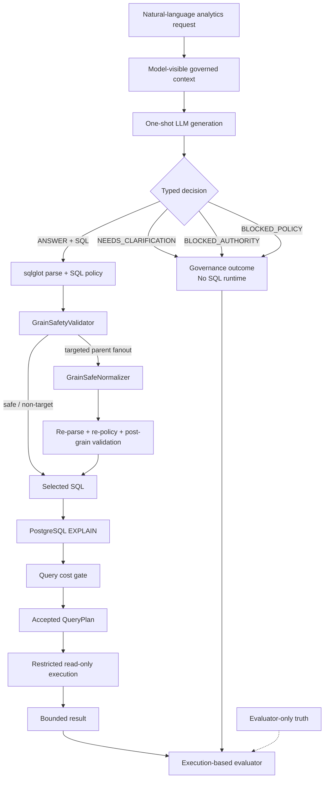

# Decision-SQL

**Governed one-shot Text-to-SQL with deterministic runtime safety and execution-based evaluation.**

> The model proposes. Deterministic software decides what may execute.

Decision-SQL is a governed one-shot Text-to-SQL system and execution-based
benchmark for enterprise analytics. A model receives a natural-language
request plus a model-visible, governed context and emits exactly one typed
decision. That decision may be an answer with read-only SQL, a clarification,
or a policy/authority block.

Model output is never trusted directly. An `ANSWER + SQL` submission crosses a
deterministic admission boundary before it can reach PostgreSQL. The benchmark
also contains cases where producing SQL is the wrong behavior, so governance is
evaluated separately from query execution. SQL correctness is semantic
execution correctness, not string similarity.

## Latest result

M48B.2 completed the current frozen 90-case synthetic governed benchmark under
the documented one-shot runtime contract:

| Metric | Result |
| --- | ---: |
| Governed Task Success | **78 / 90 = 86.7%** |
| Answerable End-to-End Runtime TSA | **51 / 60 = 85.0%** |
| BASE Delivered Correctness | **51 / 60 = 85.0%** |
| `ANSWER` selected | **53 / 60** |
| Conditional Runtime Correctness | **51 / 53 = 96.2%** |
| Wrong refusals | **7 / 60** |
| Authority | **15 / 15** |
| Ambiguity | **6 / 9** |
| Policy | **6 / 6** |
| Unauthorized answers | **0 / 15** |

Runtime-stage outcomes were:

| Stage outcome | Count |
| --- | ---: |
| SQL parse rejections | 0 |
| SQL policy rejections | 0 |
| Semantic rejections | 0 |
| Cost rejections | 0 |
| Execution failures | 0 |
| Result mismatches | 2 |

These are results on a frozen 90-case synthetic governed benchmark under the
documented one-shot contract. They are not general Text-to-SQL accuracy,
production accuracy, universal SQL correctness, or a comparison against every
public benchmark.

## Architecture

The current validated path is:

```text
natural-language request
        ↓
model-visible governed context
        ↓
one-shot typed model decision
        ↓
deterministic runtime admission
        ↓
restricted execution
        ↓
execution-based semantic evaluation
```



Evaluator truth scores behavior. It does not route production runtime.

### What the model owns

The model owns the first-pass decision and, when it chooses `ANSWER`, the
proposed SQL. It does not own authorization, physical schema truth, grain
semantics, cost admission, or the right to execute.

### What deterministic software owns

The server owns typed decision validation, SQL parsing and policy, server-owned
semantic metadata, optional narrow grain-safe normalization, PostgreSQL
`EXPLAIN`, cost admission, accepted `QueryPlan` creation, read-only execution,
and benchmark result comparison.

## Why one-shot?

The benchmark isolates first-pass behavior:

```text
1 benchmark case
→ 1 semantic model attempt
→ 1 persisted response
→ no retry
→ no LLM repair
→ no judge
→ no selector
→ no reflection
→ no pass@K
```

This reveals model decision errors, SQL semantic errors, deterministic runtime
behavior, and unsafe assumptions that retries can hide. Production systems may
use repair loops, human confirmation, retries, or agents; Decision-SQL
deliberately excludes them from this benchmark so model behavior and
server-side enforcement remain observable.

The final one-shot response corpus was assembled without duplicate semantic
attempts. Earlier experiments were aborted when harness changes were required
after genuine responses had already been acquired. Those responses were
preserved under new experiment identities, request-hash compatibility was
verified, and only previously unattempted cases were generated:

| Response origin | Count |
| --- | ---: |
| `INHERITED_M48B` | 1 |
| `INHERITED_M48B1` | 73 |
| `NEW_M48B2` | 16 |
| Total | 90 |

Retries were 0, duplicate semantic attempts were 0, and the final response
corpus hash is:

```text
f86b07d37b52c0891f6b9e95819104b150cdc9d03825d584ed81921a854795d8
```

This is evidence discipline, not a second live arm or a score comparison with
the aborted runs.

## Governed task model

The current semantic truth is version `0.2.2-dev`, hash
`3bb0c505c1c154d8f8f14ab7e903e190ca4d0ed3488f740f68f45674585aec0e`.

| Behavior | Count | Expected model decision |
| --- | ---: | --- |
| `ANSWERABLE` | 60 | `ANSWER` + one read-only PostgreSQL `SELECT` |
| `AUTHORITY_BLOCKED` | 15 | `BLOCKED_AUTHORITY` |
| `AMBIGUOUS` | 9 | `NEEDS_CLARIFICATION` |
| `POLICY_BLOCKED` | 6 | `BLOCKED_POLICY` |
| **Total** | **90** | |

The synthetic enterprise-style database packs cover:

```text
commerce_ops
fleet_ops
support_ops
subscription_billing
warehouse_logistics
risk_operations
```

They are synthetic benchmark environments, not customer data. An answerable
case has enough authorized information for a result. An authority-blocked
case cannot be answered through the authorized relationships or context. An
ambiguous case lacks enough information to determine one unique semantic
interpretation. A policy-blocked case violates frozen query or runtime policy.

## Submission-driven runtime, truth-driven evaluation

Runtime routing is determined by the parsed model submission, not by evaluator
truth:

```text
submission.decision == ANSWER and SQL exists
        → run the actual SQL runtime

otherwise
        → bypass SQL runtime
```

Truth determines whether the submitted governed decision is correct and whether
result-contract evaluation applies. It does not decide whether an `ANSWER + SQL`
enters runtime.

For example:

```text
truth       = AMBIGUOUS
submission  = ANSWER + SQL

SQL runtime           = YES
reference comparison  = NO
governance result     = WRONG
```

The SQL receives the same real parse, policy, semantic, cost, QueryPlan, and
restricted-execution treatment as any other answer. The harness records the
runtime outcome separately and does not crash because the model made a wrong
governed decision. This branch was explicitly exercised by the
`subscription_18` regression.

Model-visible inputs include the question, public/governed schema context,
authorized metadata, and generation instructions. Evaluator-only inputs
include truth behavior, reference SQL witnesses, result contracts,
counterfactual fixtures, and expected semantic behavior. Reference SQL,
fixtures, and expected results never enter the model request.

## Runtime trust boundary

For `ANSWER + SQL`, the selected SQL follows this order:

```text
raw SQL
  ↓
sqlglot parse
  ↓
SQL/object/function policy
  ↓
GrainSafetyValidator
  ↓
optional narrow deterministic normalization
  ↓
re-parse
  ↓
re-policy
  ↓
post-grain validation
  ↓
PostgreSQL EXPLAIN
  ↓
cost policy
  ↓
accepted immutable QueryPlan
  ↓
restricted ReadOnlyExecutor
  ↓
bounded result
```

The SQL policy is PostgreSQL-oriented and uses `sqlglot`. It enforces one
statement, read-only `SELECT`/read-only CTE behavior, governed object access,
function restrictions, relationship/object policy, and complexity controls.
The reader uses a read-only transaction, statement timeout, reader-role
enforcement, and bounded result rows. This is a deterministic application
boundary, not a claim of universal SQL security or complete tenant/RLS
authorization.

The executor does not accept arbitrary SQL directly from a model response, a
normalizer, or the evaluator. Execution requires an accepted immutable
`QueryPlan` issued by the SQL safety service.

## Server-owned grain safety

Joining a parent row to several child rows can duplicate a parent measure:

```text
parent row
   |
   +-- child 1
   +-- child 2
   +-- child 3
```

A naive `SUM(parent.amount)` after that join can count the parent three times.
The model is not trusted to own this semantic contract. Server-owned metadata
describes concepts such as native entity and grain keys, relationship
cardinality, measure aggregation behavior, and legal alignment/rollup
structure. The relevant implementation is in
[`app/semantics/grain.py`](app/semantics/grain.py),
[`app/semantics/grain_normalizer.py`](app/semantics/grain_normalizer.py), and
[`app/semantics/grain_runtime.py`](app/semantics/grain_runtime.py).

The frozen normalizer is intentionally narrow. Its validated shape is:

```text
additive parent measure
+ direct declared 1:N relationship
+ supported LEFT JOIN fanout shape
+ additive child aggregation
→ deterministic child-side preaggregation
```

It is not a general SQL optimizer, universal fanout solver, or semantic
compiler. Outside the supported shape it remains fail-closed or non-target
according to the frozen contract.

Normalized SQL is never trusted automatically. It must pass re-parse,
re-policy, post-grain validation, `EXPLAIN`, the cost gate, QueryPlan creation,
and restricted execution. There is no raw unsafe fallback.

M48B.2 observed the following fresh/inherited runtime evidence:

| Grain metric | Result |
| --- | ---: |
| `PARENT_MEASURE_FANOUT` states | 4 |
| Normalized | 4 / 4 |
| Normalization precision | 100% |
| Normalization regressions | 0 |
| Safe SQL rewrites | 0 |
| Unauthorized relationships introduced | 0 |
| Unsafe raw fallback | 0 |

`subscription_04` is the fresh end-to-end example where the raw fanout defect
was corrected by the frozen deterministic normalizer. This evidence applies to
the supported shape above; it does not establish universal grain repair.

## Execution-based correctness

Correctness is not one gold SQL string. Candidate SQL is not judged primarily
by exact SQL text or AST equality.

The answerable benchmark uses two independent reference SQL witnesses, a typed
`ResultContract`, execution on the BASE database, and execution across
counterfactual database states. Reference SQL is evidence of a valid semantic
implementation, not a canonical string the model is expected to reproduce.

### Why counterfactual fixtures matter

On one database state, wrong SQL can accidentally return the same rows as
correct SQL. A counterfactual fixture changes relevant rows or distributions so
that the two semantics diverge. A candidate must continue to satisfy the typed
result contract across those discriminating states.

The frozen semantic benchmark contains:

```text
120/120 reference witnesses
184/184 semantic fixture comparisons
190/190 mutants killed
0 invalid mutants
0 surviving mutants
```

Mutants are intentionally wrong behaviors used to verify that the fixtures
actually discriminate semantic errors.

## Deterministic PostgreSQL planner state

PostgreSQL `EXPLAIN` costs depend on planner statistics. A freshly reset
synthetic table can expose `reltuples = -1` and missing `pg_stats`, which is not
representative of a maintained database. The frozen runtime environment uses
`ANALYZE_CURRENT_STATE` before each reader-planning state.

BASE state:

```text
reset
→ seed
→ commit
→ ANALYZE all benchmark relations in deterministic sorted order
→ reader/runtime planning
```

Counterfactual state:

```text
reset
→ seed
→ apply frozen fixture
→ commit
→ ANALYZE all benchmark relations in deterministic sorted order
→ reader/runtime planning
```

`ANALYZE` is environment preparation. It is not inside `SqlSafetyService`,
`QueryCostGate`, `ReadOnlyExecutor`, or the request path; it is not performed
under the reader role and is excluded from request latency.

The current contract is:

```text
planner-statistics-contract-1
hash: a97222f4e036af28120a4ee12d9ef4352513796f54a15d6f2050b56a6ae77863
PostgreSQL: 16.15
max_plan_rows: 100000
max_plan_cost: 100000.0
```

These cost limits are frozen benchmark/runtime policy, not universal production
defaults. SQL that exceeds them is rejected before execution.

## Current end-to-end evidence

The current answerable funnel is:

```text
60 ANSWERABLE
      ↓
53 ANSWER selected
      ↓
53 parse pass
      ↓
53 policy pass
      ↓
53 semantic/runtime admission
      ↓
53 cost pass
      ↓
53 execution success
      ↓
51 BASE correct
      ↓
51 full counterfactual correct
```

Conditional on choosing `ANSWER`, runtime correctness was 51/53 = 96.2%.
The current bottleneck is therefore concentrated more in model decisioning and
abstention than in SQL parsing, runtime policy, cost admission, or execution
infrastructure.

### What remains failing

There are 12 answerable/governance residual failures in the completed corpus:

```text
7 wrong refusals
3 wrong governance decisions
2 result mismatches
```

The three governance failures are in the ambiguity category: ambiguity scored
6/9, while authority scored 15/15 and policy scored 6/6. There were no
unauthorized answers in the 15 authority-blocked cases. M49 has not run; it is
the planned zero-call analysis of the remaining causal mechanisms, not a result
that should be inferred from these counts alone.

## Branch-complete harness validation

The final harness was tested against the entire valid decision space before the
remaining responses were generated:

```text
90 cases × 4 valid model decisions = 360 synthetic scenarios
360/360 scenarios
16/16 truth × decision classes
90 ANSWER runtime routes
270 non-ANSWER runtime bypasses
60 answerable result-bundle branches
0 non-answerable bundle accesses
214 runtime states
```

This matters because a wrong model decision must still produce a typed outcome.
For example, `truth = AMBIGUOUS` and `model = ANSWER + SQL` means real SQL
runtime is exercised, governance is wrong, reference/result evaluation is not
applicable, and the harness does not throw a missing-reference exception.

## Reproducibility and experiment discipline

The M48B.2 contract froze the prompt hash
`119ec8cfe489b9ef373e764a2e0702dcc0dc298090b906f41e582858c1f59ecb`, the
planner-statistics contract, runtime component identities, request hashes, and
response provenance before evaluation. Counterfactual replay and raw semantic
forensics used zero provider calls. No retry, repair, selector, judge,
reflection, or second live arm was introduced.

The main evidence is in the [M48B.2 summary](benchmark/reports/m48b2_end_to_end_summary.md)
and [machine-readable summary](benchmark/reports/m48b2_end_to_end_summary.json).
The complete audit is under [`benchmark/audits/m48b2/`](benchmark/audits/m48b2/),
with the frozen contract in
[`benchmark/manifests/m48b2_branch_complete_runtime_contract.json`](benchmark/manifests/m48b2_branch_complete_runtime_contract.json).

## Repository map

```text
app/
├── execution/
│   ├── cost.py
│   └── reader.py
├── generation/
├── semantics/
│   ├── grain.py
│   ├── grain_normalizer.py
│   └── grain_runtime.py
└── sql/
    ├── parser.py
    ├── policy.py
    └── service.py

benchmark/
├── audits/
├── manifests/
├── reports/
└── ...

evaluation/external/
docs/
```

The runtime boundary is concentrated in
[`app/sql/service.py`](app/sql/service.py),
[`app/sql/parser.py`](app/sql/parser.py),
[`app/sql/policy.py`](app/sql/policy.py),
[`app/execution/cost.py`](app/execution/cost.py), and
[`app/execution/reader.py`](app/execution/reader.py). The benchmark harness
and historical evidence are separate from production application code.

## Tech stack

The active project uses Python 3.12, FastAPI, PostgreSQL, SQLAlchemy, Alembic,
`sqlglot`, Pydantic, pytest, Ruff, mypy, OpenTelemetry, and an
OpenAI-compatible generation boundary. The application also exposes a minimal
health route; this repository does not currently claim a general public
Text-to-SQL endpoint.

## Scope and limitations

The current evidence supports governed one-shot decision evaluation,
deterministic SQL safety, the narrow grain-normalization mechanism described
above, an accepted-`QueryPlan` execution boundary, restricted read-only
execution, execution-based semantic evaluation, counterfactual testing, and
reproducible planner state.

It does not establish:

- universal Text-to-SQL correctness;
- universal fanout or grain repair;
- production readiness for arbitrary enterprise schemas;
- complete tenant-level authorization or RLS coverage;
- universal business-semantic understanding;
- guaranteed correctness or safety for SQL outside the frozen runtime and
  benchmark contracts.

## Research lineage

The repository preserves historical experiments around external BIRD/Defog
evaluations, governed metric compilation, verified-query memory,
result-equivalence contracts, logical-plan experiments, prompt interventions,
authority semantics, JSON typing, grain semantics, deterministic normalization,
and runtime integration. Those experiments remain valuable provenance, but they
are not all active components of today’s runtime.

Browse the preserved material in [`docs/`](docs/),
[`evaluation/external/`](evaluation/external/),
[`benchmark/audits/`](benchmark/audits/), and
[`benchmark/reports/`](benchmark/reports/). The root README intentionally
describes the current system rather than reproducing the M3/M4/M7/M10-era
chronology.

## Next

**M49 — Fresh Residual Failure Forensics**

```text
provider calls: 0
model calls: 0
architecture changes: 0
```

M49 will use only frozen M48B.2 evidence to classify the remaining failures by
causal mechanism before another intervention is selected. It is not being run
as part of this documentation update.
