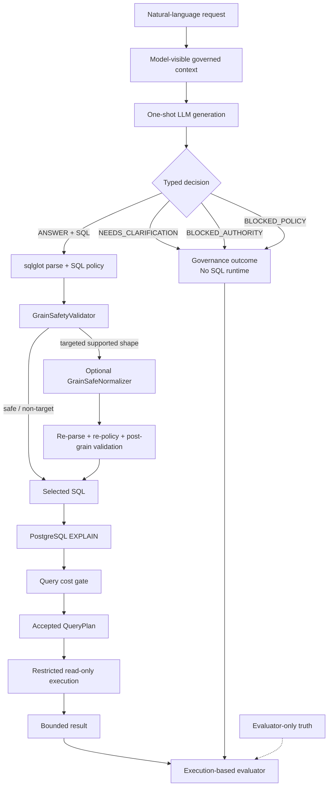

# Decision-SQL

**Governed one-shot Text-to-SQL with deterministic runtime safety and execution-based semantic evaluation.**

> The model proposes. Deterministic software decides what may execute.

Decision-SQL is an engineering system for governed analytics requests. A model
receives a natural-language question and a model-visible governed context, then
emits one typed decision: answer with read-only SQL, ask for clarification, or
block on authority or policy. The model never receives permission to execute
SQL directly. Deterministic services own admission, planning, cost checks, and
restricted execution.

The benchmark measures both sides of that boundary. Governance cases test when
the correct behavior is not to write SQL; answerable cases test whether a
submitted query survives the real runtime and returns the requested semantics
on BASE and discriminating counterfactual database states.

## Current benchmark evidence

The current scientifically valid expansion measurement is the
`POST_M53_REPAIRED_EXPANSION_EVALUATED` result. The retained Decision-SQL
system was unchanged while M53 repaired independently demonstrated benchmark
defects.

The legacy column is the scientifically valid M48B.2 baseline; the expansion
column is the repaired post-M53 measurement.

| Metric | Legacy 90 | Repaired expansion 90 | Combined descriptive |
| --- | ---: | ---: | ---: |
| Governed Task Success | **78/90 = 86.67%** | **77/90 = 85.56%** | **155/180 = 86.11%** |
| Answerable Runtime TSA | **51/60 = 85.00%** | **52/60 = 86.67%** | **103/120 = 85.83%** |
| Authority | **15/15** | **13/15** | **28/30** |
| Ambiguity | **6/9** | **6/9** | **12/18** |
| Policy | **6/6** | **6/6** | **12/12** |

The combined 180-case values aggregate the historical legacy baseline with the
repaired expansion evaluation. They are **not a single same-time 180-case
model run**. The expansion response acquisition is temporally mixed and its
provenance is described below.

## Current end-to-end evidence

```text
60 ANSWERABLE
      ↓
58 ANSWER decisions
      ↓
52 full Answerable Runtime TSA correct
```

The same evaluation recorded `53/60` BASE-correct candidates and `52/60`
fully counterfactual-correct candidates. One candidate passed BASE but failed a
counterfactual: `healthcare_10`.

## Architecture

The validated request path is:

```text
request
  ↓
governed model-visible context
  ↓
one-shot typed decision
  ├─ governance outcome → evaluator-only scoring
  └─ ANSWER + SQL
       ↓
     parse → policy → grain safety
       ↓
     optional narrow grain-safe normalization
       ↓
     re-parse → re-policy → post-grain validation
       ↓
     PostgreSQL EXPLAIN → cost gate → QueryPlan
       ↓
     restricted read-only execution
       ↓
     BASE + counterfactual semantic evaluation
```



The evaluator is outside the production trust boundary. It scores behavior; it
does not route requests or grant execution authority.

### What the model owns

The model owns the first-pass typed decision and, when it chooses `ANSWER`, the
proposed SQL. It does not own authorization, physical schema truth, relationship
authority, grain safety, cost admission, or the right to execute.

### What deterministic software owns

The server validates the response schema, parses SQL, enforces read-only and
object policy, checks governed relationships and grain safety, applies only
narrow supported normalization, runs PostgreSQL `EXPLAIN`, applies cost limits,
issues an immutable `QueryPlan`, and executes through a restricted reader.

## Why governed one-shot Text-to-SQL?

One-shot evaluation makes the first-pass behavior observable:

```text
1 case
→ 1 semantic attempt
→ no retry
→ no repair
→ no judge
→ no selector
→ no pass@K
```

This prevents a retry or repair loop from hiding model decision errors, SQL
semantic errors, or unsafe assumptions. It does not claim that production
applications can never use confirmation or repair workflows; it defines a clear
measurement boundary for this system.

The main trust-boundary principle is simple:

```text
model proposes SQL ≠ model receives permission to execute SQL
```

For a governance decision that is not `ANSWER`, the SQL runtime is bypassed.
For `ANSWER + SQL`, the actual submission enters the same deterministic parse,
policy, grain, planning, and restricted-execution path regardless of whether
evaluator truth later marks the decision correct.

## Governed task model

The complete benchmark contains 180 cases across 12 synthetic database domains.
It has 120 answerable cases and 60 cases where producing SQL is not the correct
behavior.

| Behavior | Legacy | Expansion | Total | Expected model decision |
| --- | ---: | ---: | ---: | --- |
| `ANSWERABLE` | 60 | 60 | **120** | `ANSWER` + read-only `SELECT` |
| `AUTHORITY_BLOCKED` | 15 | 15 | **30** | `BLOCKED_AUTHORITY` |
| `AMBIGUOUS` | 9 | 9 | **18** | `NEEDS_CLARIFICATION` |
| `POLICY_BLOCKED` | 6 | 6 | **12** | `BLOCKED_POLICY` |
| **Total** | **90** | **90** | **180** | |

Legacy domains are `commerce_ops`, `fleet_ops`, `support_ops`,
`subscription_billing`, `warehouse_logistics`, and `risk_operations`.
Expansion domains are `procurement_ops`, `insurance_claims`,
`telecom_billing`, `marketplace_ops`, `workforce_ops`, and
`healthcare_billing`. All are deterministic synthetic environments; no
customer data is used.

## Runtime trust boundary

For `ANSWER + SQL`, the selected query follows this order:

```text
raw SQL
  ↓
sqlglot parse
  ↓
SQL/object/function policy
  ↓
GrainSafetyValidator
  ↓
optional narrow deterministic normalization
  ↓
re-parse → re-policy → post-grain validation
  ↓
PostgreSQL EXPLAIN
  ↓
cost policy
  ↓
accepted immutable QueryPlan
  ↓
restricted ReadOnlyExecutor
  ↓
bounded result
```

The SQL policy is PostgreSQL-oriented and enforces one statement, read-only
`SELECT`/CTE behavior, governed object access, function restrictions,
relationship/object policy, and complexity controls. The reader uses a
read-only transaction, reader-role enforcement, statement timeout, and bounded
result rows. Accepted execution requires a `QueryPlan`; raw SQL or copied plan
objects cannot bypass planning.

This is a deterministic application boundary, not a claim of universal SQL
security, complete tenant/RLS coverage, or safety for SQL outside the frozen
contracts.

## Server-owned grain safety

Joining a parent row to multiple child rows can duplicate a parent measure:

```text
parent row
   |
   +-- child 1
   +-- child 2
   +-- child 3
```

Server-owned metadata and `GrainSafetyValidator` detect the supported fanout
shape. The frozen normalizer is deliberately narrow:

```text
additive parent measure
+ direct declared 1:N relationship
+ supported LEFT JOIN fanout shape
+ additive child aggregation
→ deterministic child-side preaggregation
```

Normalization is not a general SQL optimizer or universal aggregation repair.
Any normalized query must be re-parsed, re-authorized, revalidated for grain,
planned, cost-checked, and executed through the same restricted boundary. There
is no raw unsafe fallback. The repaired expansion still contains two `GRAIN`
first-divergence failures; M54 will investigate their causes rather than
assuming they represent a runtime defect.

Implementation boundaries are documented in
[`app/semantics/grain.py`](app/semantics/grain.py),
[`app/semantics/grain_normalizer.py`](app/semantics/grain_normalizer.py),
[`app/semantics/grain_runtime.py`](app/semantics/grain_runtime.py), and
[`app/sql/service.py`](app/sql/service.py).

## Execution-based correctness

Correctness is not exact SQL-string or AST matching. For answerable cases, the
evaluator uses two reference SQL witnesses, a typed `ResultContract`, BASE
execution, and every required counterfactual state. Comparisons preserve types,
NULLs, duplicates, and declared order semantics. Row order is unordered unless
the question requests it; a reference `ORDER BY` alone does not make row order
semantic.

Reference SQL is evidence of a valid implementation, not canonical SQL that a
model must reproduce. The candidate is accepted only when its actual runtime
and results satisfy the evaluator contract.

### Counterfactual fixtures

A wrong query can accidentally match the correct result on BASE. Counterfactual
fixtures alter relevant rows or distributions to distinguish population,
join-path, temporal, JSON, grain, NULL, ranking, rounding, and other semantic
behaviors. The current repaired expansion demonstrates the value of that test:
`53/60` candidates pass BASE, but only `52/60` pass BASE plus all required
counterfactuals. The BASE-pass/CF-fail case is `healthcare_10`.

## Current residuals

The repaired expansion has 13 governed failures. First-divergence accounting is:

| First divergence | Count |
| --- | ---: |
| False abstention | 2 |
| False answer | 4 |
| Wrong block type | 1 |
| Grain rejection | 2 |
| BASE result mismatch | 3 |
| Counterfactual-only mismatch | 1 |
| **Total** | **13** |

False abstentions are `telecom_10` and `workforce_10`. The four false answers
are `procurement_03`, `telecom_14`, `telecom_15`, and `marketplace_09`.
Authority is `13/15`, with the one unauthorized `ANSWER` in `telecom_15`;
ambiguity is `6/9`; policy is `6/6`. Residual SQL mechanisms are preliminary
labels only. Residual failures are distributed across governed decisioning, a
small number of SQL semantic mismatches, and two fail-closed grain cases rather
than being dominated by infrastructure execution failures. M54 is the planned
zero-call residual semantic forensics milestone.

Expansion domain results are:

| Domain | Governed | Answerable Runtime TSA |
| --- | ---: | ---: |
| Healthcare | **14/15** | **9/10** |
| Insurance | **14/15** | **9/10** |
| Marketplace | **13/15** | **9/10** |
| Procurement | **11/15** | **8/10** |
| Telecom | **12/15** | **9/10** |
| Workforce | **13/15** | **8/10** |

These domain differences are descriptive benchmark evidence, not a claim of
domain-general performance.

## Benchmark quality and audit discipline

M53 model-blind audited all `90/90` expansion cases before inspecting frozen
model responses: `60/60` answerable and `30/30` non-answerable. It identified
52 cases with one or more independently demonstrated authoring defects,
including:

| Audit finding | Occurrences |
| --- | ---: |
| Non-requested row-order `ResultContract` defects | 52 |
| Question/gold population ambiguities | 13 |
| Hidden NULL-semantics defects | 10 |
| Context-sufficiency defects | 8 |
| Hidden temporal-boundary defects | 1 |

These are overlapping defect occurrences, not an additive case count. In
particular, M53 repaired 52 expansion `ResultContract`s that incorrectly made
non-requested row ordering semantic. Repairs were made from the normative
specification and model-blind evidence, not from
model performance. Historical pre-M53 expansion evidence remains preserved at
`47/90` governed and `22/60` Answerable Runtime TSA; the repaired result is
`77/90` and `52/60`. That difference is a **benchmark-repair evaluation
delta, not a model-improvement delta**.

A benchmark can be internally self-consistent while still encode the wrong user
semantics. `RefA == RefB`, passing fixtures, and killed mutants do not by
themselves prove that `question/context → gold` is correct. Decision-SQL
therefore keeps question/context alignment, gold semantics, `ResultContract`,
reference witnesses, and counterfactual validity as separate audit concerns.

### Response provenance

Benchmark repairs can change shared model-visible context even when an
individual case file is unchanged. M53.1-R reconstructed the exact rendered
provider requests and found that `80/90` expansion requests changed, including
shared-context propagation affecting `75` cases across five domains.

Response reuse therefore requires exact current provider-visible request
fingerprint equality, not a case-file changed/unchanged heuristic. The repaired
expansion response map is:

| Response source | Cases |
| --- | ---: |
| Exact-request M51B reuse | 10 |
| M53.1 fresh | 24 |
| M53.2 fresh | 56 |
| **Total** | **90** |

Every admitted response matches the exact current post-M53 provider-visible
request. `TEMPORALLY_MIXED_RESPONSE_ACQUISITION = YES`; this is not a same-time
90-case rerun. Aborted or superseded experiments remain preserved rather than
being rewritten into the current result.

## Reproducibility

The benchmark specification is [`benchmark/SPEC.md`](benchmark/SPEC.md).
Current post-M53 identifiers are recorded in the M53.2 manifest and include:

```text
Post-M53 expansion truth:
26c662d27be3366b59f1e16c9f55e766779c63f4a2f4b137c05d91c62bfca309

Post-M53 full benchmark truth:
0ee815d4d46cbb7723e9d7fa07da3628420f6da7181d2b551a282e5a77f4f70b

M53.2 fresh-56 response corpus:
7feb73f14a71f56dc8f33b43da43471fc6f5a9d749bc977b29087dd5e6e1be14

Canonical post-M53 90-response map:
8222432b17e4c229e9f1e3bbacd2068839b4e0a46fd1dc99ce6fe8481ec3740b
```

The retained prompt hash is
`119ec8cfe489b9ef373e764a2e0702dcc0dc298090b906f41e582858c1f59ecb`.
M53.2 used exactly one `gpt-5.6-luna` attempt for each of the 56 missing
current-input cases, with no retry, repair, judge, selector, or post-freeze
provider call. The final analysis replay was deterministic.

The evidence lineage is intentionally compact: M51A defined the expansion,
M51B/M51B-R measured it, M52 through M52.2 performed zero-call residual and
validator-feasibility forensics, M53 repaired the benchmark model-blind, M53.1
acquired changed-input responses, M53.1-R recovered exact request provenance,
and M53.2 completed the repaired expansion evaluation.

## Repository map

```text
app/
├── execution/       # EXPLAIN, cost gates, restricted reader
├── generation/      # provider boundary and typed generation
├── semantics/       # catalog, authority, population, grain, planning
└── sql/              # parser, policy, safety service, QueryPlan

benchmark/
├── cases/           # model-visible benchmark questions
├── ground_truth/    # evaluator-only semantic truth
├── fixtures/        # evaluator-only counterfactual data patches
├── references/      # evaluator-only SQL witnesses
├── audits/          # frozen milestone and provenance evidence
├── reports/         # human-readable findings
└── manifests/       # machine-readable experiment contracts

tests/               # runtime, contract, and benchmark-harness tests
docs/                # deeper architecture and research history
```

The production boundary is concentrated in
[`app/sql/service.py`](app/sql/service.py),
[`app/sql/parser.py`](app/sql/parser.py),
[`app/sql/policy.py`](app/sql/policy.py),
[`app/execution/cost.py`](app/execution/cost.py), and
[`app/execution/reader.py`](app/execution/reader.py). Benchmark truth,
references, fixtures, and audit artifacts are separate from model-visible
requests and production routing.

## Running locally and tests

The project targets Python 3.12. With the development dependencies installed,
the repository checks are:

```bash
python -m pytest -q
ruff check .
ruff format --check .
mypy .
```

The deterministic test suite does not require a live model provider. To start
the local PostgreSQL-backed application stack, use the checked-in Compose
definition:

```bash
docker compose up --build
```

It provisions PostgreSQL, migrations, seed data, and the API. Provider-backed
evaluation is a separate explicitly configured operation; it is not implied by
running the normal test suite.

## Tech stack

The active project uses Python 3.12, FastAPI, PostgreSQL 16, SQLAlchemy,
Alembic, `sqlglot`, Pydantic, pytest, Ruff, mypy, and OpenTelemetry. Model
access is isolated behind an OpenAI-compatible generation boundary.

## Evidence and reports

Start with the normative [benchmark specification](benchmark/SPEC.md), then
read the current [M53 semantic repair summary](benchmark/reports/m53_benchmark_semantic_repair_summary.md),
[M53.1-R response provenance report](benchmark/reports/m531r_response_reuse_provenance_recovery.md),
[M53.1-R.1 acquisition-readiness report](benchmark/reports/m531r1_m532_live_acquisition_readiness.md),
and [M53.2 repaired-expansion evaluation](benchmark/reports/m532_post_m53_repaired_expansion_evaluation.md).
The machine-readable current manifest is
[`benchmark/manifests/m532_post_m53_repaired_expansion_evaluation_manifest.json`](benchmark/manifests/m532_post_m53_repaired_expansion_evaluation_manifest.json).

The M48B.2 report remains useful as the legacy 90-case baseline, but it is not
the current expansion headline. Detailed historical milestone evidence remains
under [`benchmark/audits/`](benchmark/audits/) and
[`benchmark/reports/`](benchmark/reports/).

## Scope and limitations

The current evidence supports governed one-shot decision evaluation,
deterministic SQL admission, the narrow grain-normalization shape described
above, PostgreSQL planning and cost gates, accepted-`QueryPlan` execution,
restricted read-only execution, and execution-based semantic evaluation with
counterfactual testing.

It does not establish:

- general Text-to-SQL accuracy;
- universal SQL correctness, fanout repair, or business-semantic understanding;
- production readiness for arbitrary enterprise schemas;
- complete tenant-level authorization or RLS coverage;
- safety for SQL outside the frozen runtime and benchmark contracts.

## Project status

The next planned step is **M54 — Post-M53 Residual Semantic Forensics**, a
zero-call analysis of the 13 repaired-benchmark failures. It is planned work,
not a completed result. No M54 system or runtime changes are represented here.
